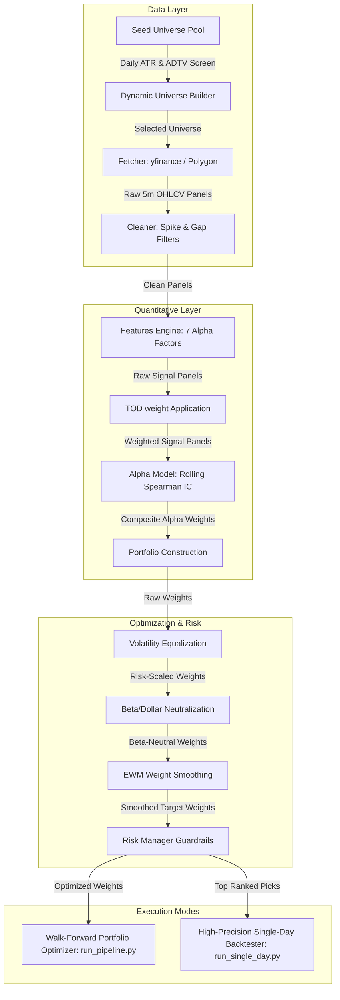

# 📈 Developer & Quant Onboarding Guide: NASDAQ Intraday Mean Reversion Strategy

Welcome to the quantitative trading team! This document is designed to get you fully onboarded, set up, and writing code in our **Intraday Cross-Sectional Mean Reversion Trading Pipeline** for US Equities (NASDAQ/NYSE). 

This codebase represents a professional-grade, systematic strategy designed to exploit short-term idiosyncratic price deviations in highly liquid US growth and tech stocks.

---

## 🗺️ Table of Contents
1. [🌟 Project Vision & Strategy Summary](#-project-vision--strategy-summary)
2. [📐 System Architecture](#-system-architecture)
3. [🚀 Quick-Start developer Setup](#-quick-start-developer-setup)
4. [📂 Codebase Tour & Directory Mapping](#-codebase-tour--directory-mapping)
5. [🧠 The Quant Engines Deep Dive](#-the-quant-engines-deep-dive)
6. [🕹️ The Two Running Playbooks](#-the-two-running-playbooks)
7. [✍️ Hands-On Tutorial: Adding a New Alpha Feature](#-hands-on-tutorial-adding-a-new-alpha-feature)
8. [📊 ADR & Version Management](#-adr--version-management)
9. [⚠️ Quant Gotchas & Debugging Playbook](#-quant-gotchas--debugging-playbook)

---

## 🌟 Project Vision & Strategy Summary

The core hypothesis of this strategy is that **large, rapid intraday idiosyncratic price moves (deviations from index and sector benchmarks) in highly active growth stocks are overextended and likely to revert toward their local average.**

### Key Strategy Mechanics:
- **Dollar-Neutral & Beta-Neutral:** The portfolio rebalances to ensure that net dollar and market-beta exposures are strictly minimized. For every dollar long, there is an equal risk-weighted dollar short.
- **7-Factor Alpha Engine:** Computes features across raw price, VWAP deviations, volume shocks, volatility spikes, and residual returns relative to the benchmark (`QQQ`).
- **Dynamic Feature Allocation:** Uses a **rolling Spearman Rank Information Coefficient (IC)** framework to dynamically shift weight toward predictive factors and completely zero out underperforming ones.
- **Pure Intraday Execution:** To prevent overnight gap risk, all positions are established intraday and **strictly flattened** before the market close (by 3:50 PM EST).

---

## 📐 System Architecture

The following diagram illustrates the complete, modular data flow of our trading engine:



---

## 🚀 Quick-Start Developer Setup

Getting your environment ready is straightforward. We use standard Python libraries and target **Python 3.9+**.

### 1. Set Up Your Environment
Clone the repository and initialize your virtual environment:
```bash
# Clone the repository
git clone <repository_url>
cd NEW_APPROACH

# Create a virtual environment
python -m venv .venv

# Activate it (Windows PowerShell)
& .venv\Scripts\Activate.ps1
# Or Command Prompt: .venv\Scripts\activate.bat
# Or macOS/Linux: source .venv/bin/activate
```

### 2. Install Dependencies
```bash
pip install -r requirements.txt
```
*Note: Key packages include `yfinance` for public data, `polygon-api-client` for high-fidelity tick data, `pandas` and `numpy` for vectorised operations, and `scipy` for statistical computations.*

### 3. API Key Configuration
We use **Polygon.io** for institutional-grade tick and bar data and fallback to **yfinance**. Add your API key in the `.env` file at the root:
```env
POLYGON_API_KEY=your_polygon_api_key_here
```

### 4. Run the Test Drive 🏎️
Verify your setup immediately by running a fast pipeline backtest on just three high-volume tickers for 30 days:
```bash
python run_pipeline.py --tickers NVDA TSLA AAPL --days 30
```

---

## 📂 Codebase Tour & Directory Mapping

Here is the functional layout of the repository. Take a minute to familiarize yourself with these directories:

```
NEW_APPROACH/
│
├── config/                  # Configuration System
│   ├── config.yaml          # Active NASDAQ/US Strategy Master Config
│   └── config_nse.yaml      # Legacy Indian NSE Configuration
│
├── nse_pipeline/            # Data Fetching, Cleaning & Universe Ingestion Engine
│   │                        # Note: Retained name 'nse_pipeline' post v1.0.0 US migration 
│   ├── fetcher.py           # Multi-threaded yfinance/Polygon market hours fetcher
│   ├── cleaner.py           # Outlier, volume-spike, and trade-gap filter rules
│   ├── storage.py           # Compressed snappy Parquet reader and writer
│   ├── universe.py          # Dynamic ATR & Liquidity screening for NASDAQ universe
│   └── orchestrator.py      # End-to-end Pipeline runner (universe -> storage)
│
├── features/                # Core Alpha Mathematics & Signal Primitives
│   ├── core.py              # Math Primitives: Cross-sectional z-score, rankings, rolling MAD
│   ├── engine.py            # The 7-Factor Alpha Feature logic & Time-of-Day weighting
│   ├── store.py             # Feature caching and retrieval manager
│   └── resampler.py         # Sub-minute to 5m resampler helper
│
├── alpha/                   # Portfolio Math, Signal Integration & Risk Layers
│   ├── stock_picker.py      # Pre-open scorer and picker for single-day execution
│   ├── signal.py            # Dynamic Spearman Rank IC estimator & weight resolver
│   ├── portfolio.py         # Volatility-equalization, rebalancing, & gross leverage sizing
│   ├── execution.py         # Intraday execution simulator (stops, targets, trailing rules)
│   ├── risk_management.py   # Drawdown limits, index-correlation scaling, & extreme move limits
│   └── regularized_zscore.py# Regularized cross-sectional normalizer
│
├── scripts/                 # Utility Scripts
│   └── fetch_polygon.py     # Standalone Polygon.io batch data ingestion script
│
├── data/                    # Local Raw and Processed Snappy Parquet Storage (Auto-generated)
├── reports/                 # Pipeline logs, backtesting summaries, and IC tables (Auto-generated)
│
├── run_pipeline.py          # End-to-End Walk-Forward Backtester & Optimizer Entry-Point
├── run_single_day.py        # High-Precision Day-Trading Simulation Entry-Point
├── REQUIREMENTS.txt         # Package dependencies
└── CHANGELOG_ADR.md         # Architecture Decision Records & Version History (Crucial!)
```

> [!IMPORTANT]
> **Why is it called `nse_pipeline`?**
> The strategy originally targeted the Indian Stock Exchange (NSE). In version **v1.0.0**, we migrated entirely to the US market (NASDAQ). The namespace `nse_pipeline` was kept intact to preserve imports, but all logic within it has been fully rebuilt to handle US trading sessions (9:30 AM - 4:00 PM EST), US timezone safety, and USD liquidity.

---

## 🧠 The Quant Engines Deep Dive

Our strategy isolates idiosyncratic alphas by separating **Math Primitives** from **Economic Hypotheses** (a key Citadel design principle).

### 1. Cross-Sectional Normalisation (`features/core.py`)
To isolate stock-specific anomalies, all features are normalized across the active trading universe at *every single bar* (cross-sectionally):
- **Cross-Sectional Z-Score (`cs_zscore`)**:
  $$z(i, t) = \frac{x(i, t) - \mu_{\text{cs}}(t)}{\sigma_{\text{cs}}(t)}$$
  This centers signals at zero, standardizes volatility across the universe, and winsorizes extreme outliers at $\pm 3\sigma$.
- **Cross-Sectional Rank (`cs_rank`)**: Scales raw signals strictly to $[-1, +1]$. This is immune to heavy-tailed distributions and represents pure ordinal rankings.

---

### 2. The 7-Factor Alpha Engine (`features/engine.py`)

Every 5-minute bar, the strategy computes 7 indicators for every stock in the universe:

| Factor Code | Factor Name | Economic Hypothesis | Mathematical Formulation |
| :--- | :--- | :--- | :--- |
| **`A1`** | **Bar Reversal** | Intrabar price thrusts often exhaust local liquidity and quickly snap back. | $z\left(-\frac{\text{Close} - \text{Open}}{\text{ATR}}\right)$ |
| **`A2`** | **Short Rev** | 15-minute price momentum exhaustion. | $z\left(0.5 \cdot z(-\text{Ret}_{15\text{m}}) + 0.5 \cdot \text{Rank}(-\text{Ret}_{15\text{m}})\right)$ |
| **`B1`** | **VWAP Dev** | Institutional execution algorithms anchor to session VWAP; price reverts to this mean. | $z\left(-\frac{\text{Close} - \text{VWAP}}{\text{VWAP}} \cdot \sqrt{\text{SessionFraction}}\right)$ |
| **`C1`** | **Vol Shock** | Extreme volume spikes reflect capitulation/exhaustion rather than trend continuation. | $z(\log(\text{Volume}) - \text{Median}(\log(\text{Volume}))_{\text{Time-of-Day}})$ |
| **`D1`** | **Vol Burst** | High range opposite to bar close represents buyer/seller exhaustion. | $z\left(\left(\frac{\text{High} - \text{Low}}{\text{ATR}_{30}} - 1\right) \cdot \text{Sign}(\text{Open} - \text{Close})\right)$ |
| **`E1`** | **Residual Return**| Isolates purely stock-specific noise from broad market (`QQQ`) moves. | residual of: $\text{Ret}_{15\text{m}}(i) \sim \beta_i \cdot \text{Ret}_{15\text{m}}(\text{Market})$ |
| **`F1`** | **Mkt Exhaustion** | Reaches threshold when stock moves $> 1.5\times$ its trailing 20-day intraday range. | $z\left(-\frac{\text{SessionReturn}}{\text{AvgIntradayRange}_{20\text{d}}}\right)$ |

---

### 3. Time-of-Day (TOD) Weights
Intraday volatility is not uniform. The strategy multiplies computed raw features by a Time-of-Day weight profile:
- **Opening Session (9:30 AM - 10:00 AM EST):** **1.5× weight**. This is when price discovery triggers maximum mean reversion opportunities.
- **Closing Auction (3:30 PM - 4:00 PM EST):** **1.2× weight**. High volume block-rebalancing creates micro-reversals.
- **Lunch Lull (12:00 PM - 1:30 PM EST):** **0.5× weight**. Signals are weak and noisy during lower volume periods; weights are scaled down to protect capital.

---

### 4. Dynamic Spearman Rank IC Model (`alpha/signal.py`)
Features are combined dynamically based on their live performance. The model calculates the **Spearman Rank Correlation** between each feature's signal and the subsequent $k$-bar forward return over a rolling 10-hour window (`ic_window=120` bars):
- **T-Stat Filter:** If a feature's rolling t-statistic is below `min_ic_tstat` (default 0.5), it is automatically zeroed out.
- **Adaptive Combination:** The active features are scaled and summed based on their positive/negative predictive IC, allowing the strategy to auto-adapt to changing market regimes.

---

### 5. Risk-Neutral Portfolio construction (`alpha/portfolio.py`)
To translate raw combined signals into tradable weights:
1. **Volatility Equalization:** Position weights are scaled by their inverse rolling standard deviation ($1/\sigma_i$), ensuring calm stocks and volatile stocks represent equal dollar risk.
2. **Beta & Dollar Neutralization:** Active weights are adjusted to sum to zero net exposure, and OLS is run against market beta (via `QQQ`) to eliminate broad market systematic risk.
3. **Turnover Control:** Weights are smoothed with an Exponential Weighted Moving Average (EWMA, default 30-bar halflife) to filter transaction fee drag.

---

## 🕹️ The Two Running Playbooks

As a developer, you will operate in two distinct execution environments depending on your objective:

### Playbook A: End-to-End Walk-Forward Portfolio Optimizer (`run_pipeline.py`)
Use this when you are **testing strategy-level parameters**, adding features, or examining broad walk-forward metrics (Sharpe ratio, turnover, trading costs).

- **How it works:** It fetches history, builds dynamic universes, computes signals, applies portfolio optimization, calculates transaction cost drag, and outputs full portfolio statistics.
- **Key Command Parameters:**
  ```bash
  # Run full dynamic pipeline with standard defaults (59 days history)
  python run_pipeline.py
  
  # Run a faster walk-forward backtest by passing custom tickers and days
  python run_pipeline.py --tickers AAPL MSFT NVDA AMD AMZN --days 20
  
  # Test with a higher transaction fee cost parameter (e.g. 2.0 basis points)
  python run_pipeline.py --txn-cost-bps 2.0
  
  # Adjust rebalance frequency (e.g. rebalance every 30 bars instead of 78)
  python run_pipeline.py --rebalance-freq 30
  ```
- **Where to find outputs:**
  - Standard logs: `reports/pipeline.log`
  - IC Performance Table: `reports/ic_summary.csv`
  - Portfolio statistics (net of fees): `reports/portfolio_stats.csv`

---

### Playbook B: High-Precision Single-Day Day-Trader (`run_single_day.py`)
Use this when **simulating the granular intraday execution behavior** of individual trades. This playbook models real-world order management (stop-losses, partial profit targets, trailing stops).

- **How it works:** 
  1. **Pre-Open:** Evaluates candidates at 9:30 AM.
  2. **Opening Confirm:** Picks top N (default 80) stocks based on the first 15 mins.
  3. **Execute:** Enters positions at 9:45 AM, manages dynamic trade parameters intraday.
  4. **Exits:** Flatten all trades by 3:50 PM EST.
- **Key Command Parameters:**
  ```bash
  # Backtest last 5 trading days
  python run_single_day.py --last 5
  
  # Backtest a specific historical date (e.g. 2026-04-16)
  python run_single_day.py --date 2026-04-16
  
  # Backtest a custom historical date range
  python run_single_day.py --from 2026-03-01 --to 2026-04-15
  
  # Test with strict risk controls: 1.0% stop-loss, 1.5% profit target, 2.0% trail trigger
  python run_single_day.py --stop-loss 0.01 --profit-take 0.015 --trail-trigger 0.02
  ```
- **Where to find outputs:** Prints an executive console report detailing every single trade side, execution price, exit reason, and net daily dollar profit. Detailed run logs are captured in `reports/backtest_<timestamp>.log`.

---

## ✍️ Hands-On Tutorial: Adding a New Alpha Feature

Let's walk through how to create and backtest a new quantitative factor in this codebase. We will implement a new alpha feature: **`G1_volume_acceleration`** (buying stocks that fall on decreasing volume, or selling stocks that rise on decreasing volume).

### Step 1: Add a Math Primitive in `features/core.py`
Open [features/core.py](file:///d:/Herbs%20magic/NEW_APPROACH/features/core.py) and append our volume momentum primitive:
```python
def roll_momentum(df: pd.DataFrame, window: int = 5) -> pd.DataFrame:
    """Calculate time-series rate-of-change momentum."""
    return df.pct_change(window)
```

### Step 2: Implement the Feature in `features/engine.py`
Open [features/engine.py](file:///d:/Herbs%20magic/NEW_APPROACH/features/engine.py). Inside the `FeatureEngine` class, write the feature method:
```python
    def volume_acceleration(self, window: int = 5) -> pd.DataFrame:
        """
        G1: Volume Acceleration Reversal.
        
        Hypothesis: Price moves made on accelerating volume are stable.
        Price moves on decelerating volume are exhausted and likely to revert.
        Signal: -zscore( price_momentum / volume_momentum )
        """
        from features.core import roll_momentum
        price_mom = roll_momentum(self.C, window)
        vol_mom = roll_momentum(self.V, window)
        
        # Avoid dividing by zero or extremely low numbers
        signal = -price_mom / vol_mom.replace(0.0, np.nan).abs()
        return cs_zscore(signal)
```

### Step 3: Register in `compute_all()` of `FeatureEngine`
Find the `compute_all` method in [features/engine.py](file:///d:/Herbs%20magic/NEW_APPROACH/features/engine.py#L112-L150) and register the new feature:
```python
        log.info("  [G] Volume acceleration ...")
        features["G1_volume_acceleration"] = self.volume_acceleration()
```

### Step 4: Run a Backtest to Validate
Trigger the walk-forward backtest and check the `reports/ic_summary.csv` or console output to verify if the feature passed the predictive t-statistic threshold:
```bash
python run_pipeline.py --days 30 --tickers AAPL MSFT NVDA AMD TSLA AMZN
```

---

## 📊 ADR & Version Management

This project enforces strict **Architectural Decision Records (ADRs)**. We maintain the "why" and "when" behind our model configurations, not just the "what".

### How to use `CHANGELOG_ADR.md`
Every time you perform one of the following, you **MUST** record it in [CHANGELOG_ADR.md](file:///d:/Herbs%20magic/NEW_APPROACH/CHANGELOG_ADR.md):
1. Calibrate risk parameters (e.g. stop-loss levels, rebalance windows).
2. Add or deprecate feature engines.
3. Migrate markets or asset universes.

Follow the established ADR markdown template:
```markdown
### v[MAJOR].[MINOR].[PATCH] - [Short Description]
* **Date:** YYYY-MM-DD
* **Time:** HH:MM:SS (+05:30)

#### 1. Context & Problem Statement
[Why is this change necessary?]

#### 2. Decision / Changes Implemented
[What exact mathematical or logical changes did you deploy?]

#### 3. Consequences
* **Positive:** [Expected performance improvement]
* **Risks:** [Expected edge cases or parameter sensitivities]
```

---

## ⚠️ Quant Gotchas & Debugging Playbook

Keep these system details in mind during active development:

### 1. The yfinance Intraday 59-Day Boundary
- `yfinance` imposes a strict **59-day limit** for retrieving intraday `5m` bars. If you configure `days > 59` inside `config.yaml`, the orchestrator will trigger fetching failures.
- **Solution:** For historical simulations spanning $> 59$ days, run `scripts/fetch_polygon.py` which interfaces with the Polygon API to build a local snappy Parquet cache.

### 2. Timezone Alignment
- All operations are normalized to **US Eastern Time (`US/Eastern`)** inside the pipeline to properly handle day-light savings and ensure correct opening (9:30 AM) and closing (4:00 PM) alignment.
- When injecting custom datetime indices, always localized or normalized via `pytz` or `pandas.tz_convert("US/Eastern")`.

### 3. Empty Data & Bad Ticker Filtering
- The cleaner (`nse_pipeline/cleaner.py`) automatically removes tickers with missing OHLC bars or zero volume. If you pass a list of highly illiquid tickers, they will be quietly discarded during the dynamic universe selection phase.
- **Tip:** Check `reports/universe.csv` to see exactly which stocks survived the ADTV and liquidity screening rules.

---

### Welcome onboard. Happy trading! 🚀
If you have any questions, review `CHANGELOG_ADR.md` or run a test drive of `run_pipeline.py`.
