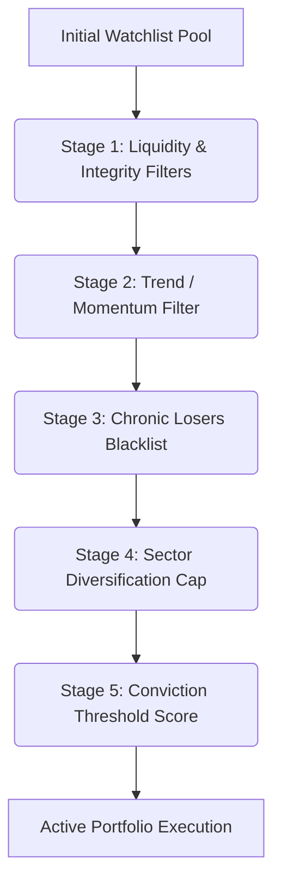

# STRATEGY BRIEFING: INTRA-DAY PORTFOLIO CONSTRUCTION & RISK FILTERING PIPELINE

This report provides a detailed breakdown of the filtering cascade used in the **Intraday Cross-Sectional Mean-Reversion Strategy** to construct risk-managed portfolios. It explains the quantitative rationale, mathematical logic, and step-by-step filtering process implemented in the production engine.

---

## 1. Executive Summary

In systematic trading, the goal of filtering is to isolate high-probability trading opportunities from systemic noise. For a **Mean-Reversion** strategy, this requires:
1. **Liquidity Guardrails:** Ensuring trade execution without significant slippage.
2. **Trend Avoidance:** Preventing entry into strong trending assets (avoiding "catching a falling knife").
3. **Diversification Controls:** Limiting sector concentration to avoid systemic sector-wide sell-offs.
4. **Signal Conviction:** Restricting capital to high-z-score opportunities where the statistical edge is greatest.

The strategy processes candidate watchlists through a **five-stage filtering cascade** before executing trades.

---

## 2. The Five-Stage Filtering Cascade

Below is the logical flow of candidate stock filtering implemented in the [StockPicker](file:///c:/My%20Programs/Internship/Herbs%20Magic/GS/Intraday_Cross_Sectional_Mean_Reversion/alpha/stock_picker.py#L89) class:

### Stage 1: Liquidity & Data Integrity Filters
* **Logic:** Checks basic liquidity metrics and data availability for the trading day.
* **Parameters:** 
  * Minimum Price: `min_price = $5.00`
  * Minimum Liquidity: `min_avg_volume = 200,000 shares` (rolling 20-day average)
* **Quantitative Rationale:**
  * **Penny Stock Avoidance:** Low-priced stocks (< \$5) are vulnerable to extreme volatility, pump-and-dump manipulation, and high percentage bid-ask spreads.
  * **Slippage Control:** Minimum average daily volume ensures that the strategy's market orders can be filled quickly with minimal market impact (slippage).

### Stage 2: Momentum (Trend) Filter
* **Logic:** Measures the absolute historical return of each stock over a rolling window. Stocks that exceed a threshold are classified as "trending" and are rejected.
* **Math / Formula:**
  $$\text{Return}_{5d} = \frac{\text{Close}_{t} - \text{Close}_{t-5}}{\text{Close}_{t-5}}$$
  $$\text{Keep if } |\text{Return}_{5d}| \le \text{momentum\_threshold} \ (5.0\%)$$
* **Quantitative Rationale:** 
  * Mean-reversion relies on temporary price overextensions that pull back to their rolling average. If an asset is in a strong, persistent multi-day trend (momentum), it is highly likely to continue moving in that direction instead of reverting. Entering counter-trend trades on these names represents a highly negative expected value.

### Stage 3: Chronic Losers Blacklist
* **Logic:** Excludes specific tickers that historically generated repeated drawdowns across multiple sessions.
* **US Market Blacklist:** `{"MSTR", "QUBT", "CLSK", "IREN", "ARM", "PRCT", "RMBS", "ACLS"}`
* **Quantitative Rationale:**
  * Outlier behaviors: certain stocks exhibit idiosyncratic microstructures (e.g., heavy retail-driven momentum, high correlation to crypto/bitcoin swings like MSTR or CLSK) that violate standard cross-sectional mean-reversion behavior. This database-driven hard filter prevents recurring losses in structural anomalies.

### Stage 4: Sector Diversification Cap
* **Logic:** Caps the total number of long/short entries belonging to the same industry/sector.
* **Parameters:** `max_per_sector = 3` (using [SECTOR_MAP](file:///c:/My%20Programs/Internship/Herbs%20Magic/GS/Intraday_Cross_Sectional_Mean_Reversion/alpha/stock_picker.py#L46))
* **Quantitative Rationale:**
  * High correlation exists among stocks in the same sector (e.g., semiconductor or clean energy sectors). Without a cap, a market sector shock would trigger simultaneous entry signals across several related stocks, turning an idiosyncratic bet into a massive sector-concentration risk.

### Stage 5: Conviction Threshold Filter
* **Logic:** Computes a composite z-score of the stock's signals across the 7-factor engine. Only stocks with high statistical deviation ($\ge \text{min\_score}$) are selected.
* **Parameters:** `min_score = 0.8` (in [run_live.py](file:///c:/My%20Programs/Internship/Herbs%20Magic/GS/Intraday_Cross_Sectional_Mean_Reversion/run_live.py#L977))
* **Quantitative Rationale:**
  * Rather than spreading capital thinly across 80 positions with low signal strength, the strategy concentrates capital on high-probability opportunities where the z-score is greater than $0.8\sigma$. 
  * If at least one ticker qualifies above the threshold, the picker bypasses lower-conviction tickers, concentrating capital on the high-conviction group.

---

## 3. Case Study: US 15D Live Session Breakdown
To illustrate how the cascade performs under live conditions, below is the execution log from the **US 15D Market Session (2026-06-25)**:

| Step / Filter Stage | Candidates Remaining | Tickers Filtered Out / Action |
| :--- | :--- | :--- |
| **Initial Watchlist Pool** | **80 Tickers** | Capped at 80 based on pre-open rankings. |
| **Stage 1: Liquidity & Integrity** | **69 Tickers** | **-11 tickers** (Failed volume/price requirements). |
| **Stage 2: Momentum Filter** | **46 Tickers** | **-23 tickers** (Trend return exceeded $\pm 5.0\%$). |
| **Stage 3: Chronic Losers Blacklist** | **44 Tickers** | **-2 tickers** (Excluded blacklisted tickers). |
| **Stage 4 & 5: Conviction & Sector Cap** | **3 Tickers** | **-41 tickers** (Failed to reach $\ge 0.8z$ score threshold). |
| **Final Portfolio Allocation** | **3 Active Trades** | **MARA** ($+1.80z$), **EQIX** ($+1.06z$), **SLAB** ($+1.03z$). |

### Capital Allocation Impact
Because the final qualified list was restricted to 3 high-conviction tickers, the portfolio divided its **\$100,000 total capital** equally across these 3 stocks:
* **MARA:** \$33,333 allocation (2491 shares)
* **EQIX:** \$33,333 allocation (30 shares)
* **SLAB:** \$33,333 allocation (152 shares)

**Result:** The strategy successfully achieved **99.51% Exposure** utilizing the entire available portfolio capital, concentrated exclusively on the top-conviction mean-reversion setups.

---

## 4. Key Takeaways for Strategy Improvement
* **System Health:** The filtering mechanism is working perfectly as designed. It successfully avoided 34 high-risk or low-liquidity names.
* **Concentration vs. Diversification:** While concentration in 3 stocks maximizes capital deployment on high-conviction signals, it increases idiosyncratic stock risk. If we prefer a more diversified portfolio (e.g. 15-20 stocks), we can lower the `min_score` from `0.8` to `0.5` in [run_live.py](file:///c:/My%20Programs/Internship/Herbs%20Magic/GS/Intraday_Cross_Sectional_Mean_Reversion/run_live.py#L977) to qualify more stocks during calmer market regimes.
